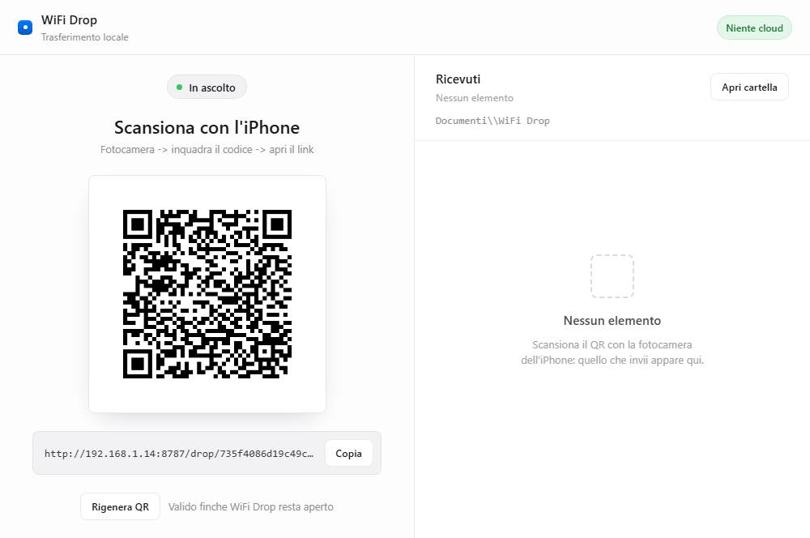
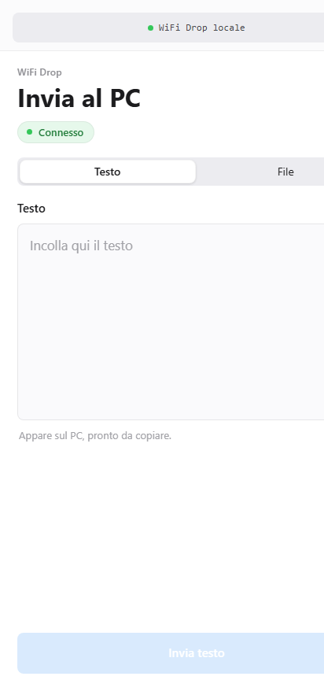

[🇬🇧 **Read in English**](README.md)

# WiFi Drop

WiFi Drop è un'applicazione leggera per Windows che consente di inviare testo, foto e file tra iPhone e PC collegati alla stessa rete Wi-Fi locale.

Nessuna app da installare su iPhone, nessun account, nessun passaggio dal cloud. Apri WiFi Drop su Windows, inquadra il codice QR con la fotocamera dell'iPhone e trasferisci direttamente tramite Safari.





## Caratteristiche

- **Invio testo da iPhone a PC**: incolla o digita testo da Safari e trovalo subito pronto da copiare sul PC.
- **Invio foto e file**: seleziona qualsiasi file o foto tramite il selettore nativo di iOS.
- **Invio bidirezionale da PC a iPhone**: prepara testi o file dalla dashboard Windows per scaricarli o copiarli su iPhone.
- **Codice QR temporaneo**: generato a ogni avvio per la massima privacy.
- **Supporto multilingua**: interfaccia disponibile in 9 lingue (Italiano, Inglese, Spagnolo, Francese, Tedesco, Portoghese, Cinese, Giapponese, Coreano).
- **Rete locale protetta**: nessun dato viene inviato a server esterni.
- **Cartella dedicata su PC**: i file ricevuti vengono salvati automaticamente in `Documenti\WiFi Drop`.
- **Accesso rapido ai file**: apri la cartella di ricezione con un click direttamente dall'app desktop.
- **Rigenerazione QR istantanea**: revoca immediatamente il link precedente con un semplice pulsante.

## Come funziona

WiFi Drop avvia un server HTTP locale leggero sul PC Windows, solitamente sulla porta `8787`.

L'applicazione desktop mostra:
- Il link privato della dashboard per il PC
- Il codice QR contenente il link temporaneo per l'iPhone
- L'elenco degli elementi e dei file ricevuti
- La sezione *Invia all'iPhone* per preparare testo e file da trasmettere al telefono

L'iPhone apre il link in Safari. La pagina mobile offre due modalità separate:
- **Testo**: invia esclusivamente il testo digitato.
- **File**: invia esclusivamente i file selezionati (il testo inserito nella scheda Testo non viene incluso).

La stessa pagina su iPhone mostra la sezione **Dal PC**: i testi preparati su Windows possono essere copiati negli appunti dell'iPhone e i file possono essere aperti o scaricati da Safari.

L'interfaccia rileva automaticamente la lingua di sistema o del browser ed è sempre possibile selezionarla manualmente tramite il menu lingue dedicato.

## Download e Installazione

### 1. Download
Vai nella sezione **[Releases](../../releases)** del repository GitHub e scarica l'installer per Windows:

```text
WiFi Drop_0.1.0_x64-setup.exe
```

### 2. Avviso Windows SmartScreen
Poiché WiFi Drop è un progetto open-source e non dispone di un costoso certificato di firma commerciale, Windows Defender SmartScreen potrebbe mostrare un avviso al primo avvio (*"PC protetto da Windows"* / *"Autore sconosciuto"*):
1. Fai clic su **Ulteriori informazioni**.
2. Fai clic su **Esegui comunque**.

> L'applicazione è sicura, completamente open source e opera esclusivamente all'interno della tua rete locale: puoi verificare personalmente l'intero codice sorgente in questo repository.

### 3. Permessi del Firewall di Windows
Al primo avvio, Windows potrebbe chiederti l'autorizzazione di rete:
- Assicurati di spuntare **Reti private (reti domestiche o aziendali)**.
- Fai clic su **Consenti accesso**.
- Verifica che sia il PC che l'iPhone siano collegati alla stessa rete Wi-Fi.

### 4. Guida rapida all'uso
1. Avvia **WiFi Drop** sul PC Windows.
2. Apri l'app **Fotocamera** sull'iPhone e inquadra il codice QR mostrato sullo schermo.
3. Tocca il link giallo che compare nel mirino della fotocamera per aprire WiFi Drop in Safari.
4. Invia o ricevi file e testi immediatamente!

## Sviluppo

Requisiti:
- Windows 10 o successivo
- Node.js
- Rust (installato tramite `rustup`)
- Microsoft Visual Studio Build Tools con il carico di lavoro C++
- WebView2 Runtime

Installa le dipendenze:

```powershell
npm install
```

Avvia in modalità sviluppo:

```powershell
npm run dev
```

Compila l'installer per Windows:

```powershell
npm run build
```

L'eseguibile di installazione verrà generato in:

```text
src-tauri\target\release\bundle\nsis\
```

## Note sulla Sicurezza

WiFi Drop è pensato per l'uso su reti locali fidate:
- Il codice QR contiene un token casuale generato all'avvio.
- La rigenerazione del codice QR invalida all'istante il link precedente.
- Nessun file o dato viene mai caricato su server esterni o cloud.
- Chiunque si trovi sulla stessa rete Wi-Fi e possieda il link QR attivo può inviare file mentre l'app è in esecuzione.

## Licenza

MIT
